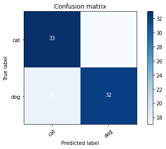

## Training a simple CNN image recogniser using Keras

### Imports:
```python
import numpy as np
import tensorflow as tf
from tensorflow import keras
from tensorflow.keras.models import Sequential
from tensorflow.keras.layers import Activation, Dense, Flatten, BatchNormalization, Conv2D, MaxPool2D
from tensorflow.keras.optimizers import Adam
from tensorflow.keras.metrics import categorical_crossentropy
from tensorflow.keras.preprocessing.image import ImageDataGenerator
from sklearn.metrics import confusion_matrix
import itertools
import os
import shutil
import random
import glob
import matplotlib.pyplot as plt
```

### Preparing image generators:
Now lets prepare image generators for feeding training , testing and validation data . 

The images for different classes are organised by their class names in each of training , validataion and test folders.

```python
train_path = os.path.join('train_images_path')
test_path = os.path.join('test_images_path')
val_path = os.path.join('val_images_path')

train_batches = ImageDataGenerator(preprocessing_function=tf.keras.applications.vgg16.preprocess_input).flow_from_directory(directory=train_path, target_size=(224,224), classes=['cat','dog'], batch_size=10)
test_batches = ImageDataGenerator(preprocessing_function=tf.keras.applications.vgg16.preprocess_input).flow_from_directory(directory=test_path, target_size=(224,224), classes=['cat','dog'], batch_size=10, shuffle= False)
val_batches = ImageDataGenerator(preprocessing_function=tf.keras.applications.vgg16.preprocess_input).flow_from_directory(directory=val_path, target_size=(224,224), classes=['cat','dog'], batch_size=10)

```

### Utility function to check sample images in ImageGenerators

```python
def plotImages(images_arr):
  fig, axes = plt.subplots(1, 10, figsize=(20,20))
  axes = axes.flatten()
  for img ,ax in zip( images_arr, axes):
    ax.axis('off')
    ax.imshow(img)
  plt.tight_layout()
  plt.show()

imgs, labels = next(train_batches)

plotImages(imgs)
```

### Creating the model

```python
model = Sequential()
model.add(Conv2D(filters=32, kernel_size=(3,3), padding='same',activation='relu',input_shape=(224,224,3)))
model.add(MaxPool2D(pool_size=(2,2),strides=2))
model.add(Conv2D(filters=64, kernel_size=(3,3), padding='same',activation='relu'))
model.add(MaxPool2D(pool_size=(2,2),strides=2))
model.add(Flatten())
model.add(Dense(activation='softmax',units=2))
model.summary()

model.compile(optimizer=Adam(learning_rate=0.0001), loss ='categorical_crossentropy',metrics=['accuracy'])

model.fit(x=train_batches,validation_data=val_batches,steps_per_epoch=len(train_batches), validation_steps=len(val_batches), epochs=10, verbose=2)
```

Running the above model gave me a validation accuracy of about 68% .

### Testing Test Data Set:

Lets get test data set Inference:
```python
predictions = model.predict(x=test_batches, batch_size=10)
predictions_indexes = predictions.argmax(axis = -1)
```

Lets check the test_batch's actual labels:

```python
actual_labels = test_batches.classes
```

Lets plot the confusion matrix to see how well our model is performing on 100 test image datasets

```python
def plot_confusion_matrix(cm, classes,
                          normalize=False,
                          title='Confusion matrix',
                          cmap=plt.cm.Blues):
    """
    This function prints and plots the confusion matrix.
    Normalization can be applied by setting `normalize=True`.
    """
    plt.imshow(cm, interpolation='nearest', cmap=cmap)
    plt.title(title)
    plt.colorbar()
    tick_marks = np.arange(len(classes))
    plt.xticks(tick_marks, classes, rotation=45)
    plt.yticks(tick_marks, classes)

    if normalize:
        cm = cm.astype('float') / cm.sum(axis=1)[:, np.newaxis]
        print("Normalized confusion matrix")
    else:
        print('Confusion matrix, without normalization')

    print(cm)

    thresh = cm.max() / 2.
    for i, j in itertools.product(range(cm.shape[0]), range(cm.shape[1])):
        plt.text(j, i, cm[i, j],
            horizontalalignment="center",
            color="white" if cm[i, j] > thresh else "black")

    plt.tight_layout()
    plt.ylabel('True label')
    plt.xlabel('Predicted label')

cm = confusion_matrix(y_pred=prediction_idexes, y_true=test_batches.classes )

plot_confusion_matrix(cm, classes=['cat','dog'])
```




### Useful Utilities:

Unzipping folder in python
```python
import zipfile
with zipfile.ZipFile(path_to_zip_file, 'r') as zip_ref:
    zip_ref.extractall(directory_to_extract_to)
```